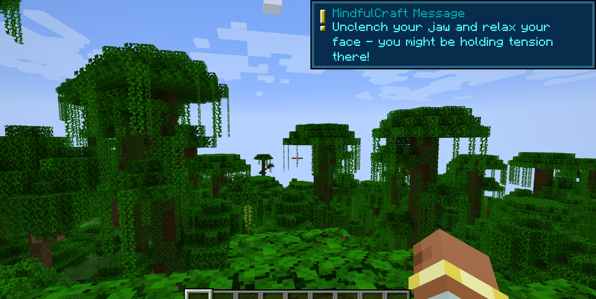

  

**MindfulCraft** is a mod that sends mindful messages to the player every so often based on a customizable config file.

## Features  
- [X] Generates a config file on client startup if one doesn't exist
- [X] Checks version of config file to guarantee latest message updates
- [X] Client reads from config file to get settings
- [X] On world join, sends an initial message if the mod is enabled
- [X] Every X ticks, based on config, sends a mindful message
- [X] When all messages are sent (in a random order with no repeats), resets the list and starts over
- [ ] Add a drastically large amount of messages  
  - Current # of simple messages: **18**
  - Current # of unique messages: **20**
- [X] Improve config understandability (see [Config Guide](#config-guide))
- [X] Add tons of commands for customization (see [Command Guide](#command-guide))
- [ ] Implement more options into config, possibly split into multiple files
- [ ] Super stretch: create own UI popup with more customization as opposed to using Minecraft's built-in toast system

## Message Examples
**Simple Message 1**
  
  
**Simple Message 2**
  
  
**Unique Message 1**


**Unique Message 2**


**Unique Message 3**


**How it shows up in-game**


## Config Guide
The config file can be found at `config/mindfulcraft-config.toml` (after running the game once), which can be edited with any text editor. You can change the values for the interval between messages, add or remove messages, and enable or disable the mod.   
  
Adding messages should be done in the following format:
```js
  {id=#, title="String", message="String", enabled=boolean, titleColor="String", messageColor="String"},
```
- `id` is a whole number that should be unique between messages  
- `title` is the title of the message that will be displayed at the top of the toast  
  - **Important Note**: This title can not include a comma (`,`) or the config file will break
- `message` is the message that will be displayed in the body of the toast 
  - **Important Note**: This message can not include a comma (`,`) or the config file will break
- `enabled` is a boolean that determines if the message can be sent - if you're setting to false anyway, you can also just remove the message unless you think you'll want to re-enable it later
- `titleColor` is a string that represents the color of the title text, which can be any of the colors below:
- `messageColor` is a string that represents the color of the message text, which can be any of the colors below:
```js
 "black", "dark_blue", "dark_green", "dark_aqua", "dark_red", "dark_purple", "gold", "gray", "dark_gray", "blue", "green", "aqua", "red", "light_purple", "yellow", "white"
```

## Command Guide
Required arguments are surrounded by `[brackets]`  

### `/mindfulcraft` and `/mindfulcraft help`
- Displays the help message

### `/mindfulcraft get TimeRemaining`
- Displays the time remaining until the next message is sent

### `/mindfulcraft get ConfigPath`
- Displays the path to the config file

### `/mindfulcraft get ConfigVersion`
- Displays the version of the config file

### `/mindfulcraft get TicksBetweenMessages`
- Displays the number of ticks between messages, as well as minutes and seconds

### `/mindfulcraft get Messages [pageNumber]`
- Displays 5 messages at a time, starting at the page number specified

### `/mindfulcraft set TicksBetweenMessages [ticks]`
- Sets the number of ticks between messages

### `/mindfulcraft set Message [id] [title] [message] [enabled] [titleColor] [messageColor]`
- Overwrites the title, message, enabled status, and colors of a message by ID

### `/mindfulcraft add Message [title] [message] [enabled] [titleColor] [messageColor]`
- Adds a new message with the specified title, message, enabled status, and colors

### `/mindfulcraft remove Message [id]`
- Removes a message by ID

### `/mindfulcraft enable MindfulCraft`
- Enables the mod

### `/mindfulcraft enable Message [id]`
- Enables a message by ID

### `/mindfulcraft disable MindfulCraft`
- Disables the mod

### `/mindfulcraft disable Message [id]`
- Disables a message by ID
